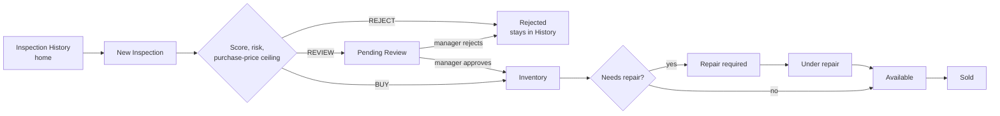

# DeviceInspector — Second-Hand Electronics MVP

**Scenario:** The Second-Hand Electronics Market.

## Problem and primary user

The business's costliest failure is a bad purchase decision — buying a risky or misrepresented device from a seller who's since gone, which can erase the profit from several good sales. The root cause: every employee inspects differently, so purchase calls can't be justified afterward. This MVP standardizes inspection into a deterministic condition score, risk score, and purchase-price ceiling, so bad buys are caught before money changes hands, with a full record from intake through purchase, repair, and sale.

Primary users: intake employees and managers; the repair queue also supports technicians once a device is purchased. Explaining what the business charges customers is a related problem this MVP doesn't solve — it only prices what the business pays sellers.

## How it works



- Standardized physical/functional/battery/repair-history/identification checklist drives a deterministic condition score, risk score, and purchase-price ceiling (`src/lib/evaluation.ts`). Max buy price = adjusted market value − repair cost − risk buffer − desired profit.
- Duplicate serial/IMEI checks block re-intake of active or pending devices; a rejected-history match needs explicit acknowledgement.
- A simple warranty summary (coverage/exclusions/duration) is derived from inspection results — guidance only, not claims handling.
- Repair Queue lets a technician take and complete a repair, returning the device to Available.
- No standalone dashboard: History already gives search/filters, and the owner's stated problems are about decision quality, not an aggregate status view.

## Assumptions and exclusions

All devices, sellers, prices, and repairs are mock data; persisted in browser `localStorage`, no backend. The identifier check is a local traceability safeguard, not a real ownership/stolen-device lookup. To preserve scope: no auth, technician accounts, real marketplace pricing, cloud photo storage, parts/invoices, warranty claims, or notifications.

## Run locally

```bash
npm install
npm run dev
```

## With five more hours

1. **Role-oriented pages** (Inspector / Manager / Technician), no auth — matches "employees have different levels of technical knowledge," keeps each screen scoped to one decision.
2. **QA/re-inspection step** before a repaired device returns to Available, closing the loop on "faults appear only after extended use" — currently repair completion has no re-verification.
